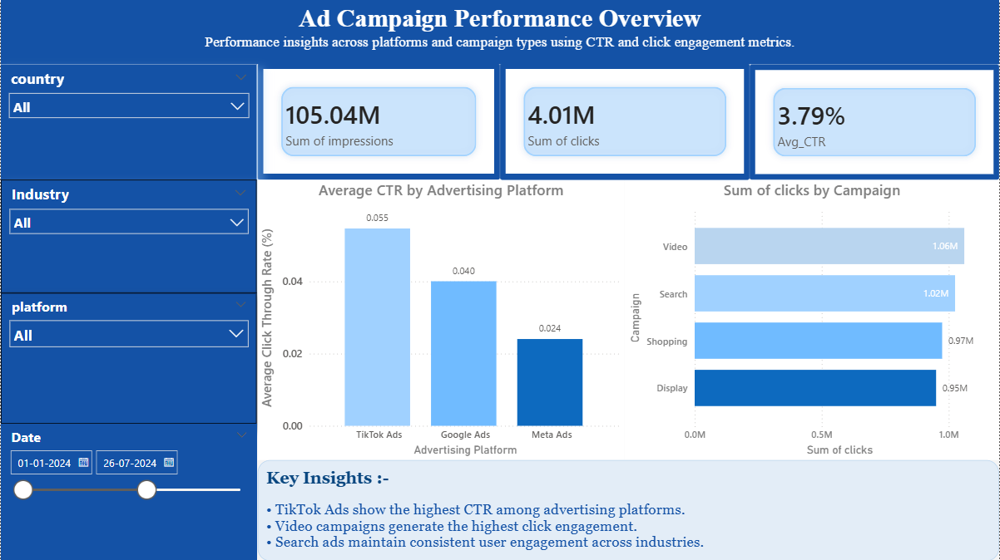
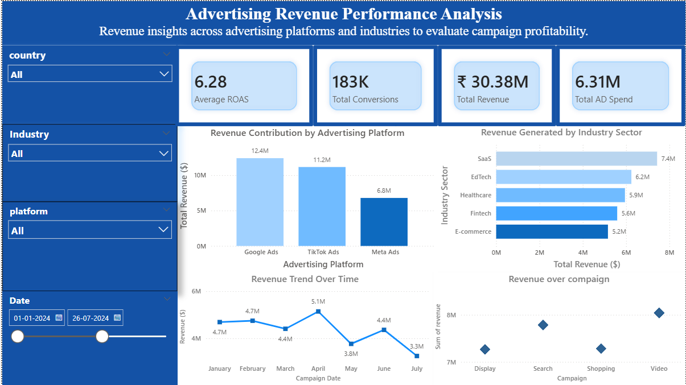
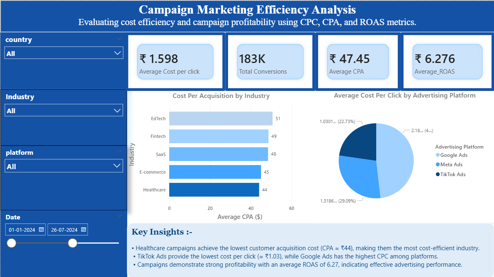
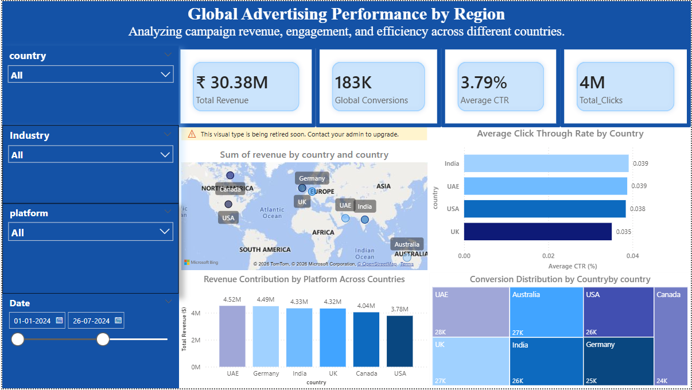

# 📊 Digital Advertising Analytics Dashboard

## 📌 Project Overview

This project presents an **interactive Power BI dashboard** designed to analyze and monitor the performance of digital advertising campaigns. The dashboard evaluates key marketing metrics such as **Click Through Rate (CTR), Cost Per Click (CPC), Cost Per Acquisition (CPA), and Return on Ad Spend (ROAS)** across different advertising platforms, industries, and geographic regions.

The objective of this project is to help marketing teams and decision-makers **optimize advertising strategies, improve campaign efficiency, and identify high-performing platforms and markets through data-driven insights.**

---

## 🎯 Objectives

- Analyze digital advertising campaign performance using key marketing metrics.
- Identify the most effective advertising platforms and campaign types.
- Evaluate cost efficiency using **CPC, CPA, and ROAS** metrics.
- Understand geographic performance to optimize marketing investments.
- Provide actionable insights through **interactive dashboards.**

---

## 🛠 Tools & Technologies

- **Power BI** – Data visualization and dashboard creation  
- **DAX (Data Analysis Expressions)** – Calculated metrics and measures  
- **CSV Dataset** – Advertising performance dataset  

---

## 📂 Dataset Information

The dataset used in this project contains advertising campaign performance data including:

- Date
- Platform (Google Ads, Meta Ads, TikTok Ads)
- Campaign Type
- Industry
- Country
- Impressions
- Clicks
- Conversions
- Revenue
- Ad Spend
- CPC (Cost Per Click)
- CPA (Cost Per Acquisition)
- CTR (Click Through Rate)
- ROAS (Return on Ad Spend)

---

## 📈 Key Metrics Explained

### CTR (Click Through Rate)
Measures the percentage of users who clicked an ad after seeing it.

### CPC (Cost Per Click)
The cost incurred for each click on an advertisement.

### CPA (Cost Per Acquisition)
Measures the cost required to acquire a customer or conversion.

### ROAS (Return on Ad Spend)
Measures revenue generated for each unit of advertising spend.

---

## 📊 Dashboard Pages

### 1️⃣ Ad Campaign Performance Overview

Provides insights into engagement and advertising performance across platforms.

#### Key Highlights

- Total impressions and clicks
- Average CTR by advertising platform
- Click distribution by campaign type
- Campaign engagement comparison

📷 Screenshot:

---

### 2️⃣ Revenue Analysis

Analyzes revenue performance across advertising platforms and industries.

#### Key Highlights

- Revenue contribution by advertising platform
- Revenue trends across industries
- Campaign profitability evaluation
- Platform revenue comparison

📷 Screenshot:

---

### 3️⃣ Campaign Marketing Efficiency

Evaluates cost efficiency and campaign profitability.

#### Key Highlights

- Average Cost Per Click (CPC)
- Cost Per Acquisition (CPA) by industry
- Return on Ad Spend (ROAS)
- Platform cost comparison

📷 Screenshot:

---

### 4️⃣ Geographic Performance Analysis

Explores advertising campaign performance across different countries.

#### Key Highlights

- Revenue distribution by country
- CTR comparison across regions
- Platform performance across geographic markets
- Conversion distribution by country

📷 Screenshot:

---

## 🔍 Key Insights

- **TikTok Ads demonstrate the highest CTR**, indicating strong user engagement compared to other platforms.
- **Healthcare industry campaigns show the lowest CPA**, making them the most cost-efficient for customer acquisition.
- **Google Ads generate the highest CPC**, reflecting higher competition and premium advertising placement.
- **Average ROAS above 6 indicates strong profitability**, meaning campaigns generate over six times the revenue compared to ad spend.
- Certain geographic regions contribute significantly more revenue, highlighting potential markets for marketing expansion.
